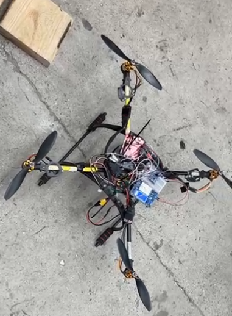
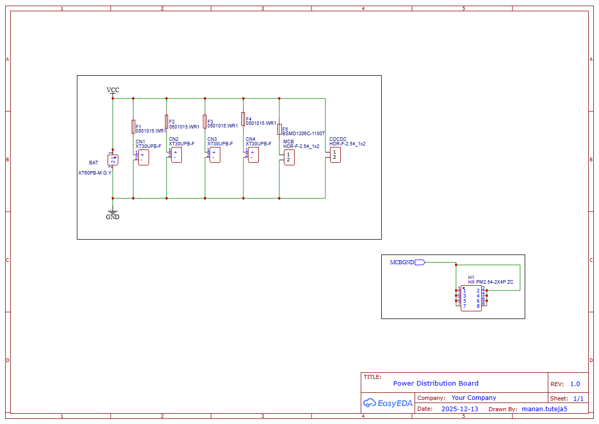
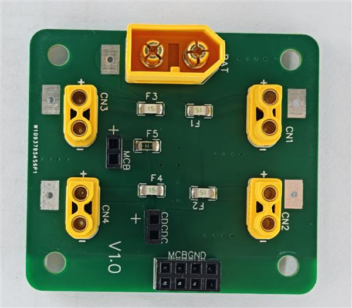

# PROJECT: DRONE

### Flight Demonstration
<a href="https://youtube.com/shorts/0YHDy_s_eys" target="_blank" rel="noopener noreferrer" class="video-link">
  <figure class="video-container">
    

      
      

      

    

    <figcaption>Click to watch the drone flight demonstration</figcaption>
  </figure>
</a>

---

## Software
ok here we can add the arduino code n stuff and cv stuff asw. we should make an Arduino App Lab project in here

## Hardware

### Components
| Category | Component | Detail |
| :--- | :--- | :--- |
| **MCB** | Arduino Uno | Flight Control Logic |
| **IMU** | Adafruit BNO055 | 9-DOF Absolute Orientation |
| **Motor** | Turnigy D2822/17 | 1100KV (28mm diameter) |
| **ESC** | HobbyKing Skywalker | 20A 2-3S LiPo |
| **Propeller** | GEMFAN 9 x 4.7R | High-efficiency Nylon |
| **Battery** | 3S LiPo | 2700 mAh |
| **RX / TX** | RadioMaster | XR2 Nano / Pocket Internal |

---

### Power Distribution Board (PDB)
The custom PDB is engineered to handle high-current throughput required for quadrotor drone.

* **Construction:** 2 oz copper trace on a 2-Layer Power PCB.
* **Thermal Design:** Stitched layers to allow for the high amperage draw of the motors.
* **Protection:** Individual fuses for each ESC via XT30 connectors.
* **Connectivity:** Integrated XT60 battery lead and dedicated header pins for the Buck Converter and MCB.
* **Grounding:** 2x4 Header Pin Block ensuring all ESCs and the MCB share a common reference ground.

  
   
  <strong>Figure 1:</strong> <em>PDB Schematic showing XT60 connector and ESC fuse layout.</em>

  
   
  <strong>Figure 2:</strong> <em>Fabricated Physical PDB PCB.</em>

---

## Aerodynamics
Theoretical parameters and lift calculations are derived using the following thrust model:

$$\text{Thrust per motor} = C_\tau \rho \omega^2 D^4$$

Where:
* $C_\tau$: Thrust Coefficient (dimensionless)
* $\rho$: Air density [kg/m³]
* $\omega$: Propeller angular velocity [revs/s]
* $D$: Propeller diameter [m]

> [!NOTE]
> Please refer to `DroneSetup.py` for specific aerodynamic calculations and theoretical drone parameters. (This will be further expanded on later).

---